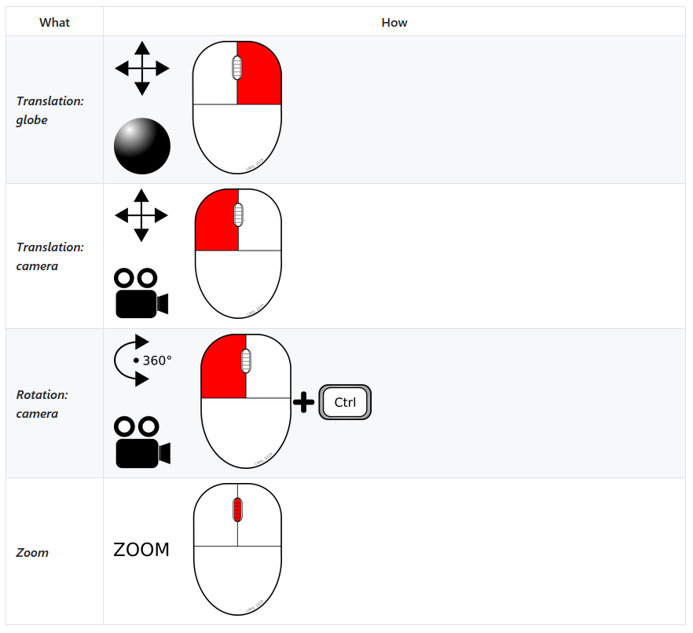
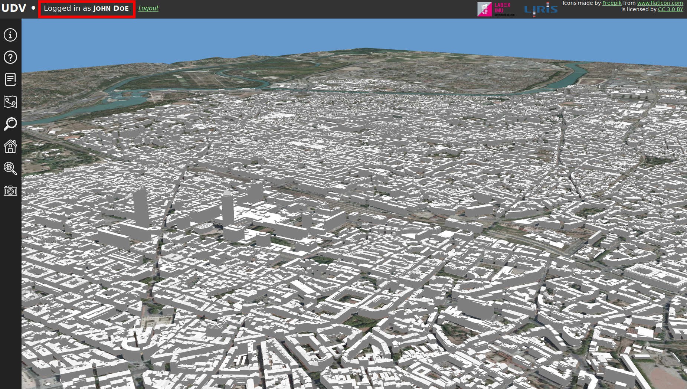
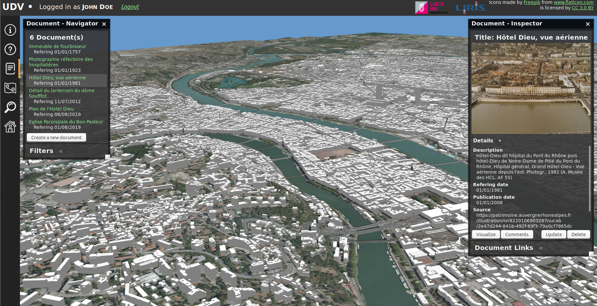
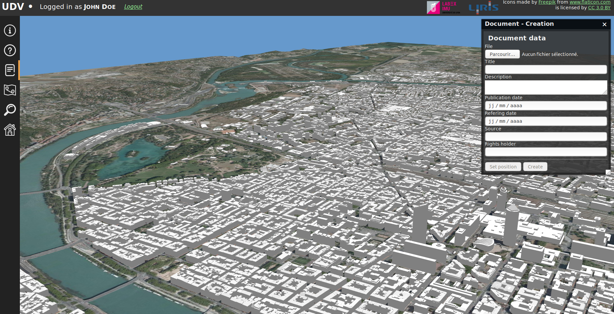
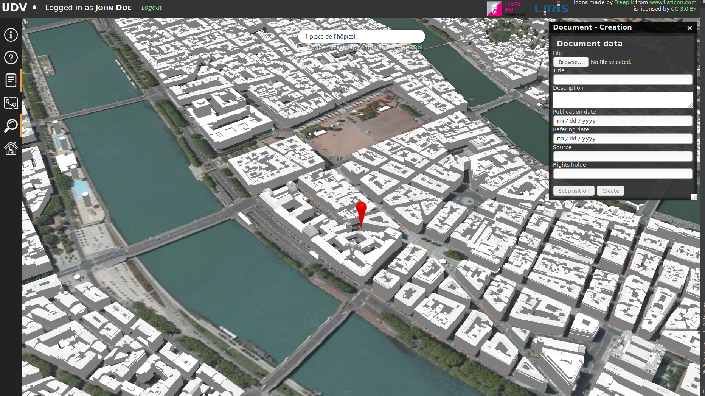
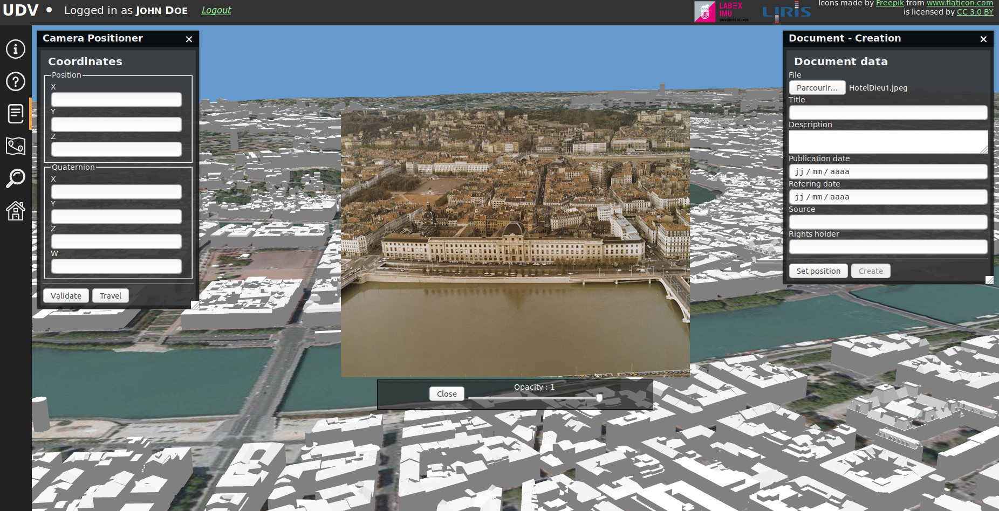

# Contribute to the project with new data

UD-Viz is developed in the context of the [VCity research project](https://projet.liris.cnrs.fr/vcity/wiki/doku.php). 
One aspect of this project is to enhance numerical representations of cities
 with documents in order to highlight and share cultural heritage and
 to understand urban evolution.
 
You can help us achieving these goals by contributing data such as historical
 documents, pictures, maps, text, etc.
 
 **Where ?** [Follow this link...](http://rict.liris.cnrs.fr/UDVDemo/UDV/UDV-Core/examples/DemoStable/Demo.html)
 
This tutorial describes step by step how you can contribute and what kind of
contributions are possible.

As a first step, you can try to navigate in the 3D scene with the following controls:

## Creating an account

Before starting contributing, you need to create an account. To do so, you must
click on the *Sign in* button on the upper-left corner of 
[the application](http://rict.liris.cnrs.fr/UDVDemo/UDV/UDV-Core/examples/DemoStable/Demo.html):

Then, you need to fill the *Registration form* and click on *Register*:

You're account is now created! You can now log in with the *Login* form on the right. 

Once you're logged in, you should see your name on the upper-left corner of
the application:

**Note**: Your account gives you **contributor** rights, meaning that
when you [add a document](#adding-a-document), it is not published right away. 
It is indeed first verified by an **administrator** to check that there is no
insanity or problems in filled attributes (see [Document validation 
process](#document-validation-process) for more information).
  
## Adding a document

One way of contributing is by adding documents. For the time being, documents
are images (jpeg or png). 

You can see existing documents by opening the **Document** module from the
left side menu:

Clicking on this menu opens the **Document Navigator** and the **Document
Inspector**.

These two windows allow to consult the documentation that has
already been added by contributors and validated by administrators. 

The **Document Navigator** (window on the left) allows to:
  * See all documents and select them for being inspected in the
   **Document Inspector**
  * Filter documents (by unfolding *Filters*) e.g. by searching into their
   titles

The **Document Inspector** (window on the right) allows to:
  * See details about the documents (e.g. description, source, publication
   date etc.)
  * Perform actions on the current document:
    * *Visualize* : Displays the document in the 3D scene
    * *Comments*: See comments on the document (see [Document validation
     process](#document-validation-process) for more information)
    * *Update*: Update the *Details* of the document
    * *Delete*: Delete the document

To add a document, click on **Create a new document** in the **Document
 Navigator**. The **Document creation window** opens:
 

To add your document, you need to:
  * Select the document file on your computer by clicking on **Browse...**
  * Fill in the fields:
    * **Title**: title/name of the document
    * **Description**: description of the document (e.g. context, more
     detailed information, etc.)
    * **Publication date**: date when the document was published (e.g. a
     picture was taken on 05/07/2019 (**refering date**) and published on
     07/08/2019 in a magazine (**publication date**))
    * **Refering date**: date to what the document refers to (e.g. a
     picture was taken on 05/07/2019 (**refering date**) and published on
     07/08/2019 in a magazine (**publication date**))
    * **Source**: source of the document (e.g. the URL from where it was
     taken from ; the name, volume and pages of the journal from where it was taken from
     , etc.)
    * **Rights Holder**: person or organization owning or managing rights
     over the document
     
  * Place the document in the 3D scene. The purpose of this step is to place
   the document in overlay to the 3D geometry it references. For instance, if
   you add a picture of a building, it should be placed in overlay to the
   building. In some cases it is not possible to do so since the document
   represents the interior of a building or is a text document for instance. 
   In this case, just place the document roughly in the location it refers to. 
   
Before placing your document, you might want to go to a specific address where you
will place it. This is possible using the **address search module**:

By clicking on the magnifying glass on the menu, a search bar will open in the top-center
of the screen:
 

 
Type in the address you're looking for and hit enter. This will initiate a
travel to the address and will identify the result in the 3D scene with a red
pin:

You can now close the **address search** module by clicking on the loop in the
left-side menu and start placing your document by clicking on **Set 
position** in the **Document Creation** window. This will display your document
in overlay to the 3D scene:

To place your document, you can play with its opacity and move in the scene
to be rightly placed above the 3D geometry. For instance:

Once you've found the right position, click on Validate in the **Camera
 Positioner** window situated on the left side of the screen.
 
You're all set, you can now click on **Create** in the **Document - Creation**
window to create your document. 

This will bring you back to the first view of the document module (**Document
Navigator** and **Document Inspector**). You might notice here that your
document does not appear immediately in the **Document Navigator**. This is totally
normal because it first needs to go through the **validation process** by an
administrator.

## Document validation process 

Under construction...
